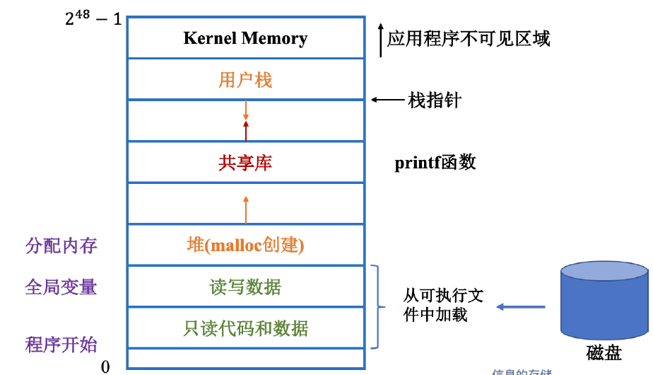

# Task01 计算机系统漫游

本次课程主要是想进行查漏补缺，因此只记录一些自己不了解或不清楚的内容，避免浪费时间且抓不住重点。

## 1.编译系统
编译系统的工作流程：
- 预处理(cpp):将引用的代码的头文件组合进程序
- 编译(ccl)：编译器对代码进行翻译、分析、优化
- 汇编(as)：将汇编程序转换为机器可执行的二进制文件
- 链接(ld)：链接引用的代码内容，进行重定向，最终得到可执行目标文件
## 2.应用与意义
- 了解编译原理的意义：
    - 有助于写出更高效的代码，优化程序的性能
    - 帮助理解链接过程中出现的错误
    - 避免安全漏洞（缓冲区溢出（buffer overflow）等）

## 3.系统的硬件组成
- CPU：
    - PC(程序计数器：Program Count):存放下一条指令地址
    - 寄存器堆(Register file):临时存放CPU运算的数据
    - ALU(算数/逻辑计算单元:Arithmatic/logic Unit):用于计算机算数和逻辑运算
- 内存：加载运行的和程序及数据
- 总线：连接计算机的各个设备，进行数据传递
- 输入输出设备：键盘、鼠标、显示器、磁盘等，通过控制器或适配器与IO总线相连
## 4.解释内存中的指令

- 程序执行流程
    - 1.键盘输入，shell程序将其读入处理器，处理器再加载到内存
    - 2.完成输入后，shell程序加载可执行文件，并将文件中的数据和代码从磁盘复制到内存（DMA技术）
    - 3.处理器执行main函数
## 5.存储设备
- 寄存器
- L1 Cache
- L2 Cache
- L3 Cache
- 主存（运行内存，DRAM）
- 本地磁盘
- 磁盘阵列、云盘
## 6.操作系统管理硬件
- 无论是shell 程序还是hello 程序都没有直接访问键盘、显示器、磁盘这些硬件设备，真正操作硬件的是操作系统，我们可以把操作系统看成是应用程序和硬件之间的中间层，所有的应用程序对硬件的操作必须通过操作系统来完成。
- 作用：
    - 1.防止硬件被失控的应用程序滥用
    - 2.操作系统提供统一的机制来控制这些复杂的底层硬件，减少底层细节，方便程序的设计和实现
- 进程：操作系统会跟踪进程运行所需要的所有状态信息，这种状态，称为上下文（Context），从而分配控制权，并且一个进程包括多个线程，使得电脑可以同时运行多个程序
## 7.虚拟内存
- 操作系统为每个进程提供了一个假象，就是每个进程都在独自占用整个内存空间，每个进程看到的内存都是一样的，我们称之为虚拟地址空间

## 8.系统加速
- 一些名词解释：
    - 任务(task)：并行计算所处理的对象.
    - 工作量(workload)：处理某任务的所需的各种开销的总和.
    - 处理器(processor)：并行计算中所使用的最基本的处理器单元.
    - 执行率(execution rat)：每个处理器单位时间能完成的工作量
    - 执行时间(execution time)：处理某任务所需的时间.
    - 加速比(scalability)：当处理器个数增多时，完成某固定工作量任务所需执行时间的减少倍数.
    - 理想加速比(ideal scalability)：处理器个数增多的比例.
    - 并行效率(parallel efficiency): 加速比÷ 理想加速比×100%.
- 阿姆达尔定律：系统中对某一部件采用更快执行方式所能获得的系统性能改进程度，取决于这种执行方式被使用的频率，或所占总执行时间的比例。
- 古斯塔法森定律
- 孙-倪定律
## 9.并发和并行
- 线程级并发（Thread-level Concurrency）
    - 超线程：当一个线程因为读取数据而进人等待状态时，CPU可以去执行另外一个线程，其中线程之间的切换只需要极少的时间代价
- 指令级并发（Instruction-level Parallelism）
- 单指令多数据并行：现代处理器拥有特殊的硬件部件，允许一条指令产生多个并行的操作，这种方式称为单指令多数据（Single-Instruction Multiple-Data Parallelism）。
