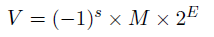

# Task02 信息的表示和处理

## 1.信息的存储
- 虚拟地址空间
    - 内存：看做一个非常大的数组
    - 数组的由一个个字节组成，每个字节都由一个唯一的数字来表示，称为**地址**(address)
    - **地址的集合**称为虚拟地址空间(virtual address space)
    - 1 Byte(字节，计算机中的**基本编码单位**) = 8 bit(比特,计算机的**最小存储单位**，表示一个二进制位)
    - 字节的存在使得计算机通常表示为16进制，一个字节能且只能由一对十六进制来表示
    - 字长（一个字的位数）决定了虚拟地址空间的上限
    - 对于32 位程序和64 位程序，主要的区别还是在于程序是如何**编译**的，而不是运行机器的类型
- 寻址和字节顺序
    - 数据在内存中的存储顺序
        - 大端：数据的低位保存在内存中的高地址中，数据的高位保存在内存中的低地址中
        - 小端：数据的低位保存在内存中的低地址中，数据的高位保存在内存中的高地址中
        - UDP/TCP/IP协议规定网络字节序为大端
        - 大多数Intel 兼容机采用小端模式，IBM 和Sun 公司的机器大多数机器采用大端法。对于很多新的处理器，支持双端法，可以配置成大端或者小端运行。例如基于ARM架构的处理器，支持双端法，但是Android 系统和iOS 系统却只能运行在小端模式
    - 字符串
        - C语言中的字符串被编码为以NULL字符结尾的字符数
        - 使用ASCII 码来表示字符，在任何系统上都会得到相同的结果。因此，文本数据比二进制数据具有更强的平台独立性
    - 打印字符在内存中对应的存储信息
    ```C++
    #include <stdio.h>
    typedef unsigned char *byte_pointer;
    void show_bytes(byte_pointer start , int len)
    {
    int i;
    for(i = 0; i < len; i++)
    {printf(” %.2x”, start[i]);}
    printf(”\n”);
    }
    void show_int(int x)
    {show_bytes ((byte pointer) &x,sizeof (×));}
    ```
    - 布尔运算：非~(NOT)、或|(OR)、与&(AND)、异或^(EOR)
    - C语言中的位级运算
        - 确定一个位级表达式结果的最好方法，就是将十六进制扩展成二进制表示，然后按位进行相应的运算，最后再转换回十六进制
        - 位运算一个常见的用法就是实现**掩码运算**，通俗点讲，通过位运算可以得到特定的位序列。例如对于操作数0x89ABCD**EF**，我们想要得到该操作数的最低有效字节的值，可以通过& 0xFF，这样我们就得到了最低有效字节0x0000 00EF。
        
    - 逻辑运算
        - 逻辑运算认为所有非零的参数都表示true，只有参数0 表示false
    - 移位运算
        - 左移(left shift)：丢弃最高的一位，并在右端补一个0
        - 逻辑右移(logical right shift)：丢弃最低的一位，并在左端补一个0
        - 算术右移(Arithmetic right shift)：当操作数的最高位为0时，运算形式与逻辑右移一致。当最高位为1时，算数右移之后，左端需要补1，而不是补0
## 2.整数表示与编码
- 整数表示
    - 有符号的二进数的表示
        - 机器数：在有符号数的前面增加1 位符号位，用0 表示正号，用1 表示负号。
        - 常用的机器数编码方法有：原码、反码和补码3 种。
        - 原码
            - 正数的符号位用“0”表示，负数的符号位用“1”表示，其余数位表示数值本身，0可认为是+0或-0，原码不唯一
            - 原码方法很简单，但是用原码表示的数在计算机中进行加减法运算很麻烦。比如遇到两个异号数相加或者两个同号数相减时，就要做减法。为了简化运算器的复杂性，提高运算速度，需要把减法做成加法运算，因此人们引入了反码和补码。
        - 反码
            - 正数的反码与其原码相同; 负数的反码是在原码的基础上保持符号位不变，其余各位按位求反得到的
        - 补码
            - 正数的补码与其原码相同; 负数的补码是在原码的基础上保持符号位不变，其它的数位1 变为0，0 变为1，最后再加1 运算。也就是说，负数的补码是它的反码加1。在计算机中，有符号整数常常用补码形式存储
            - 补码的意义
                - 避免溢出
                - 仅通过补码就可知道对应的十进制数字
                - 1 个Byte的有符号数的范围为:-128∼127.
                
    - 有符号数和无符号数转换
        - C 语言允许数据类型之间做强制类型转换
        - 有符号转无符号
        
        - 无符号转有符号
        
        - 转换规则
            - 在C 语言中，在执行一个运算时，如果一个运算数是有符号数，另外一个运算数是无符号数，那么C 语言会隐式的将有符号数强制转换成无符号数来执行运算
            - C 语言中将一个较小数据类型转换成较大的类型时，保持数值不变是可以的；但大转小不行.
        - 扩展一个数字的位表示
            - 当有符号数表示非负数时，最高位是0，此时扩展的数位进行补零即可；当有符号数表示负数时，最高位是1，此时扩展的数位需要进行补1
            - 当有符号数从一个较小的数据类型转换成较大类型时，进行符号位扩展，可以保持数值不变，反之则会发生截断，可能会改变原来的数值
- 整数运算
    - 加法
        - 无符号加法: 在C 语言执行的过程中，对于溢出的情况并不会报错
        - 有符号数（补码）加法: 溢出分为正溢出和负溢出
    - 乘法
        - 无符号乘法
        - 有符号乘法（补码乘法）：补码乘法比无符号数乘法多一步，需要将无符号数转换成补码（有符号数）
        - 如果乘或除以的是 2 的整数倍，那么可以通过位移进行快速运算
            - 原码运算：乘法为左移；除法为右移
            - 补码运算：正数则仍然按照原码规则进行计算，而负数则需要保证符号位不变，在向左移动时补 0，向右移动时补 1
- 浮点数
    - 定点表示方法
        - 小数位用2的负幂来表示
        - 这种方法并不能很有效的表示非常大的数
    - IEEE浮点表示方法
    
        - 三个变量：符号 s、阶码 E 和尾数 M
        - 以单精度浮点数为例，C 语言中float类型的变量占4个字节，32个比特位，这32个比特位被划分成3个字段来解释：最高位31位表示符号位s；第23位-30位，这8个二进制位与E相关。剩余的23位与尾数M相关。与64位双精度浮点数不同：最高位为符号位；阶码字段长11位，小数字段长52位。
        - 与64位双精度浮点数不同：最高位为符号位；阶码字段长11位，小数字段长52位。
    - 浮点数数值分类
        - 规格化的值
            - 当阶码字段的二进制位不全为 0，且不全为 1 时，此时表示的是规格化的值
        - 非规格化的值
            - 当阶码字段的二进制位全为0 时，此时表示的数值是非规格化的值
        - 特殊值
            - 当阶码字段的二进制位全为 1 时，当阶码字段的二进制位全为1 时，表示的数值为特殊值。特殊值分类为两类，一类表示无穷大或者无穷小，另外一类表示“不是一个数”。
    - 表示规格化的值时，阶码 E 的值并不等于 e (8 个二进制位) 所表示的值，而是 e 的值减去一个偏置量，偏置量的值与阶码字段的位数有关
    
        - 当表示单精度的值时，阶码字段的长度为8，偏置量等于127($2^{8-1}-1$)
        - 当表示双精度的数时，阶码字段的长度为11，偏置量等于1023($2^{11-1}-1$)
        - 尾数M被定义为1+f
    - 非规格化的值
        - 当阶码字段的二进制位全为0 时，所表示的是非规格化的值
        用途
            - 提供了表示数值0 的方法
            - 非规格化的数是可以表示非常接近0的数。
    - 特殊值
        - 当阶码字段全为1，且小数字段全为0 时，表示无穷大的数。无穷大也分为两种，正无穷大和负无穷大。如果符号位s 等于0 时，表示正无穷大；符号位s 等于1，表示负无穷大
    - 整型转单精度浮点型（有点没看懂这部分）
    - 舍入
        - **向下舍入**和**向上舍入**的情况比较简单，向下舍入总是朝向小的方向进行舍入，而向上舍入总是朝向大的方向进行舍入
        - **向零舍入**就是把正数进行向下舍入，把负数进行向上舍入。将这种舍入规则映射到数轴上，可以发现舍入是朝向零的方向
        - **向偶数舍入**，也被称为向最接近的值进行舍入
        - 由于舍入和溢出的存在，使得浮点数的加法不具有结核性，乘法不具有结合性和分配性
    - 浮点运算tips
        - C 语言提供了两种不同的浮点数据类型：单精度float 类型和双精度double 类型。当int，float、double 不同数据类型之间进行强制类型转换时，得到的结果可能会超出我们的预期。
        - 当int 类型转换成float 类型时，数字不会发生溢出，但是可能会被舍入。这是由于单精度浮点数的小数字段是23 位，可能会出现无法保留精度的情况
        - 从double 类型转换成float 类型，由于float 类型所表示数值的范围更小，所以可能会发生溢出。此外float类型的精度相对于double较小，转换后还可能被舍入
        - 将float类型或者double类型的浮点数转换成int类型，一种可能的情况是值会向零舍入，例如 1.9 将被转换成 1，-1.9 将被转换成-1；另外一种可能的情况是发生溢出