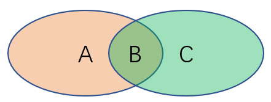

# Task01 决策树
决策树模型就是数据结构中的树，根据**特征选择依据**(信息熵)等划分特征，生成决策树，然后**剪枝**提高泛化能力，可分类可回归，代表算法有ID3，C4.5和CART

本节知识点：节点分类指标的引入原因、定义和计算，两种分类树的原理和区别，CART树与树减枝的原理。

## 1.信息论基础
### 定义 1.1 信息熵
树节点通过节点样本标签的**不确定性**来进行划分，这里使用香农提出使用**信息熵**来刻画不确定性，即：
$$
H(p_1,...,p_n)=-C\sum_{i=1}^np_i\log p_i
$$
对于离散随机变量$X$，通过拉格朗日求极值及设定特殊条件可以得出离散信息熵的最小值为0且在单点分布时取到，最大值为$\log K$且在离散均匀分布时取到。
### 定义 1.2 条件熵
条件熵指条件分布的不确定性，在给定条件X时Y的信息熵，定义条件熵为$H(Y\vert X)$为：
$$
\mathbb{E}_{X}[\mathbb{E}_{Y\vert X}[-\log_2p(Y\vert X)]]
$$

对于离散条件熵，设随机变量$X$所有可能的取值为$\{x_1,...,x_M\}$，上式可展开为
$$
-\sum_{m=1}^Mp(x_m)\sum_{k=1}^K p(y_k\vert X=x_m)\log_2p(y_k\vert X=x_m)
$$

### 定义 1.3 信息增益
信息增益（Information Gain），即节点分裂之后带来了多少不确定性的降低或纯度的提高，表示得知特征$X$的信息而使得类$Y$的信息的不确定性减少的程度。
$$
G(Y,X)=H(Y)-H(Y\vert X)
$$
通过Jensen不等式可证明，随机变量$Y$关于$X$的信息增益一定是非负的，当$X$与$Y$相互独立时信息增益为0。

## 2.分类树的节点分裂
出于性能的考量，对于每个节点进行分裂决策时，我们只会抽出max\_features个特征进行遍历以比较信息增益的大小，而不是全部遍历。

特征类别分类：**类别特征**、**数值特征**和**含缺失值的特征**

### 2.1 ID3算法
处理类别特征，对树的每一个节点会选择最大信息增益$G^{max}_N(Y,X)$对应的特征进行分裂，直到所有节点的相对最大信息增益$\frac{D_N}{D_{all}}G^{max}_N(Y,X)$ ($D_N$和$D_{all}$分别指节点$N$的样本个数和整个数据集的样本个数) 小于指定的阈值$\epsilon$。

在sklearn中，$\epsilon$即为min\_impurity\_decrease。
### 2.2 C4.5算法
在ID3算法的基础上进行改进，包括但不限于：处理数值特征、处理含缺失值的特征、使用信息增益比代替信息增益以及给出树的剪枝策略(第4节)。

#### 2.2.1 数值特征
将数值特征通过分割转化为类别。

最佳分割法和随机分割法，对应sklearn中splitter参数的best选项和random选项。

随机分割法下，取$s\sim U[x_{min}, x_{max}]$，其中$U[x_{min}, x_{max}]$代表特征最小值和最大值范围上的均匀分布，将节点样本按照特征$\mathbf{x}$中的元素是否超过$s$把样本划分为两个集合，这等价于把数值变量转换为了类别变量。此时，根据这两个类别来计算树节点分裂的信息增益，并将它作为这个数值特征分裂的信息增益。

最佳分割法下，依次令$s$取遍所有的$x_i(i=1,...,D_N)$，将其作为分割点，按照特征$\mathbf{x}$中的元素是否超过$s$把样本划分为两个集合，计算所有$s$对应信息增益的最大值，并将其作为这个数值特征分裂的信息增益。
#### 2.2.2 缺失数据
对缺失的特征施加惩罚，样本的缺失值占比越大，那么对信息增益的惩罚就越大。

设节点$N$的样本缺失值比例为$\gamma$，记非缺失值对应的类别标签和特征分别为$\tilde{Y}$和$\tilde{X}$，则修正的信息增益为
$$
\tilde{G}(Y,X) = (1-\gamma)G(\tilde{Y},\tilde{X})
$$
#### 2.2.3 信息增益比
在类别占比均匀的情况下，类别数越多则熵越高，因此信息增益来选择的决策树对类别较多的特征具有天然的倾向性。使用特征对应的熵来进行惩罚，即熵越高的变量会在信息增益上赋予更大程度的抑制，由此定义信息增益比为

$$
G^R(Y,X) = \frac{G(Y,X)}{H(X)}
$$

#### 树节点的分裂顺序

在sklearn中提供了两种生长模式：深度优先生长和最佳增益生长，当参数max_leaf_nodes使用默认值None时使用前者，当它被赋予某个数值时使用后者。

**深度优先生长**：采用深度优先搜索的方法：若当前节点存在未搜索过的子节点，则当前节点跳转到子节点进行分裂决策；若当前节点为叶节点，则调转到上一层节点，直到根节点不存在未搜索过的子节点为止。对上图而言，当前节点为2号，它的两个子节点4号和5号都没有被搜索过，因此下一步则选择两个节点中的一个进行跳转。

**最佳增益生长**：每次总是选择会带来最大相对信息增益的节点进行分裂，直到叶节点的最大数量达到max\_left\_nodes。

## 3. CART树
CART（Classification And Regression Tree）是一棵二叉树，它既能处理分类问题，又能够处理回归问题。

**注意** ：在sklearn中并**没有**实现处理类别特征和处理缺失值的功能，前者是因为多个类别的特征会产生多叉树，后者是因为sklearn认为用户应当自己决定缺失值的处理而不是交给模型来决定
### 3.1.数值标签
对于**数值标签**的处理，使用均方误差（MSE）或平均绝对误差（MAE）来替换熵和条件熵的位置。定义信息增益为：
$$
G^{MSE}(Y,X)=\frac{1}{N}\sum_{i=1}^{N}(y^{(D)}_i-\bar{y}^{(D)})^2-\frac{N_L}{N}\frac{1}{N_L}\sum_{i=1}^{N_L}(y^{(L)}_i-\bar{y}^{(L)})^2-\frac{N_R}{N}\frac{1}{N_R}\sum_{i=1}^{N_R}(y^{(R)}_i-\bar{y}^{(R)})^2
$$

$$
G^{MAE}(Y,X)=\frac{1}{N}\sum_{i=1}^{N}\vert y^{(D)}_i-\tilde{y}^{(D)}\vert-\frac{N_L}{N}\frac{1}{N_L}\sum_{i=1}^{N_L}\vert y^{(L)}_i-\tilde{y}^{(L)}\vert-\frac{N_R}{N}\sum_{i=1}^{N_R}\frac{1}{N_R}\vert y^{(R)}_i-\tilde{y}^{(R)}\vert
$$
### 3.2 基尼系数
由于对数函数$\log$的计算开销较大，CART将熵中的$\log$在$p=1$处利用一阶泰勒展开，基尼系数定义为熵的线性近似，即

$$
H(Y)=\mathbb{E}_YI(p)=\mathbb{E}_Y[-\log_2p(Y)]\approx\mathbb{E}_Y[1-p(Y)]
$$

从而定义基尼系数为

$$
\begin{aligned}
{\rm Gini}(Y)&=\mathbb{E}_Y[1-p(Y)]\\
&=\sum_{k=1}^K \tilde{p}(y_k)(1-\tilde{p}(y_k))\\
&=1-\sum_{k=1}^K\tilde{p}^2(y_k)
\end{aligned}
$$
类似地定义条件基尼系数为

$$
\begin{aligned}
{\rm Gini}(Y\vert X)&=\mathbb{E}_X[\mathbb{E}_{Y\vert X}1-p(Y\vert X)]\\
&=\sum_{m=1}^M \tilde{p}(x_m)\sum_{k=1}^K[\tilde{p}(y_k\vert x_m)(1-\tilde{p}(y_k\vert x_m))]\\
&=\sum_{m=1}^M \tilde{p}(x_m)[1-\sum_{k=1}^K\tilde{p}^2(y_k\vert x_m)]
\end{aligned}
$$
从而引出基于基尼系数的信息增益为

$$
G(Y,X)={\rm Gini}(Y)-{\rm Gini}(Y\vert X)
$$
## 4. 决策树的剪枝
为避免过拟合，采用剪枝来限制树的生长

在sklearn的CART实现中，一共有6个控制预剪枝策略的参数，最大树深度 max_depth、节点分裂的最小样本数 min_samples_split、叶节点最小样本数 min_samples_leaf、节点样本权重和与所有样本权重和之比的最小比例 min_weight_fraction_leaf、最大叶节点总数 max_leaf_nodes以及分裂阈值 min_impurity_decrease。

### 4.1 预剪枝
预剪枝是指树在判断节点是否分裂的时候就预先通过一些规则来阻止其分裂，后剪枝是指在树的节点已经全部生长完成后，通过一些规则来摘除一些子树。
### 4.2 后剪枝 
后剪枝过程又称作MCCP过程，即Minimal Cost-Complexity Pruning，它由参数ccp\_alpha控制，记其值为$\alpha$。

一般而言，树的叶子越多就越复杂，为了抑制树的生长，定义以节点$N$为根节点的树$T^N$的复杂度为该树的叶节点数量$\vert T^N\vert$。设树$T$的剪枝度量为
$$
R_\alpha(T^N)=R(T^N)+\alpha\vert T^N\vert
$$
通过设置$\alpha$来协调模型的复杂度和模型对训练数据的预测误差（如基尼指数）

## 课后习题
1. 定义$X,Y$的联合熵为$H(Y,X)$为$\mathbb{E}_{(Y,X)\sim p(y,x)}[-\log_2p(Y,X)]$
- 请证明如下关系：

    $ G(Y,X)=H(X)-H(X\vert Y)$

    $ G(Y,X)=H(X)+H(Y)-H(Y,X)$

    $ G(Y,X)=H(Y,X)-H(X\vert Y)-H(Y\vert X)$

证明：
由信息增益的定义得：
$$
\begin{aligned}
G(Y,X)&=\mathbb{E}_{Y}[-\log_2p(Y)]-\mathbb{E}_{X}[\mathbb{E}_{Y\vert X}[-\log_2p(Y\vert X)]]\\
&=-\sum_{k=1}^Kp(y_k)\log_2p(y_k)+\sum_{m=1}^Mp(x_m)\sum_{k=1}^K p(y_k\vert X=x_m)\log_2p(y_k\vert X=x_m) \\
&=-\sum_{k=1}^K[\sum_{m=1}^Mp(y_k, x_m)]\log_2p(y_k)+\sum_{k=1}^K\sum_{m=1}^M p(x_m)\frac{p(y_k, x_m)}{p(x_m)}\log_2\frac{p(y_k, x_m)}{p(x_m)}\\
&=\sum_{k=1}^K\sum_{m=1}^Mp(y_k,x_m)[\log_2\frac{p(y_k, x_m)}{p(x_m)}-\log_2p(y_k)] \\
&=-\sum_{k=1}^K\sum_{m=1}^M p(y_k,x_m) \log_2\frac{p(y_k)p(x_m)}{p(y_k, x_m)} \\
    &= \int\int P(Y,X)\log_2 \frac{P(Y,X)}{P(X)P(Y)} dxdy \\
    &= \int\int P(Y,X)\log_2 \frac{P(Y,X)}{P(Y)} dxdy - \int\int P(Y,X)\log_2 P(x) dxdy \\
    &= \int P(Y)\int P(X|Y)\log_2 P(X|Y) dxdy - \int P(X)\log_2 P(x) dxdy \\
    &= H(X) - H(X|Y)
\end{aligned}
$$
则 $ G(Y,X)=H(X)-H(X\vert Y)$得证

从而 $ G(Y,X)=H(X)-H(X\vert Y) = H(X)-(H(X,Y)-H(Y))$

即  $ G(Y,X)=H(X)+H(Y)-H(Y,X)$

再由 $ G(Y,X)=H(Y)-H(Y\vert X) $

联立以上三式可得：

$ G(Y,X)=H(Y,X)-H(X\vert Y)-H(Y\vert X)$

- 下图被分为了A、B和C三个区域。若AB区域代表X的不确定性，BC区域代表Y的不确定性，那么$H(X)$、$H(Y)$、$H(X\vert Y)$、$H(Y\vert X)$、$H(Y,X)$和$G(Y,X)$分别指代的是哪片区域？

    
    
    解：
    
    $ H(X)=A + B $

    $ H(Y)=B + C $

    $ H(X|Y)=A $

    $ H(Y|X)=C $

    $ G(Y,X)=B $

2.假设当前我们需要处理一个分类问题，请问对输入特征进行归一化会对树模型的类别输出产生影响吗？请解释原因。

答：没有影响。

原因：因为数值缩放不影响分裂点位置，它按照特征值进行排序的，排序的顺序不变，那么所属的分支以及分裂点就不会有不同。

并且树模型是不能进行梯度下降的，因为构建树模型（回归树）寻找最优点时是通过寻找最优分裂点完成的，因此树模型是阶跃的，阶跃点是不可导的，并且求导没意义，也就不需要归一化。

3.如果将系数替换为$1-\gamma^2$，请问对缺失值是加强了还是削弱了惩罚？

答：由于$\gamma$小于1，故平方后值减小，对缺失值削弱了惩罚。 

4.如果将树的生长策略从深度优先生长改为广度优先生长，假设其他参数保持不变的情况下，两个模型对应的结果输出可能不同吗？

答：模型输出结果相同。

5.在一般的机器学习问题中，我们总是通过一组参数来定义模型的损失函数，并且在训练集上以最小化该损失函数为目标进行优化。请问对于决策树而言，模型优化的目标是什么？

答: 模型的整体损失度量：$R_\alpha(T^N)=R(T^N)+\alpha\vert T^N\vert$，使得模型构建出一个与训练数据拟合很好，并且复杂度小的决策树。

6.对信息熵中的$\log$函数在$p=1$处进行一阶泰勒展开可以近似为基尼系数，那么如果在$p=1$处进行二阶泰勒展开我们可以获得什么近似指标？请写出对应指标的信息增益公式。

答：后补

7.除了信息熵和基尼系数之外，我们还可以使用节点的$1-\max_{k}p(Y=y_k)$和第$m$个子节点的$1-\max_{k}p(Y=y_k\vert X=x_m)$来作为衡量纯度的指标。请解释其合理性并给出相应的信息增益公式。

答：后补

8.为什么对没有重复特征值的数据，决策树能够做到损失为0？

答：决策树可以通过不断分裂节点记住每一个特征值，从而正确分类每一个样本，从而使得损失为0，但这样会引起极度的过拟合，并不可取。

9.如何理解min\_samples\_leaf参数能够控制回归树输出值的平滑程度？

答：后补