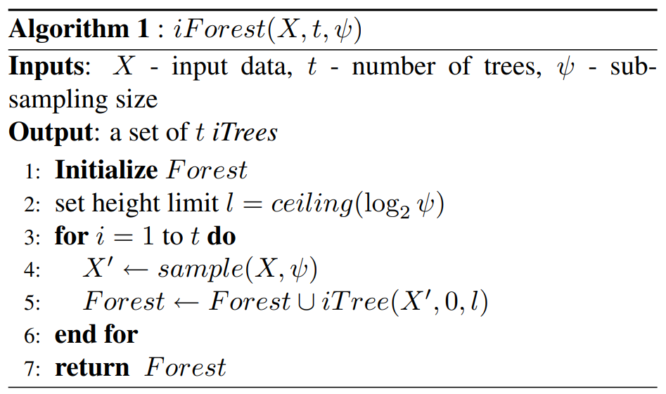
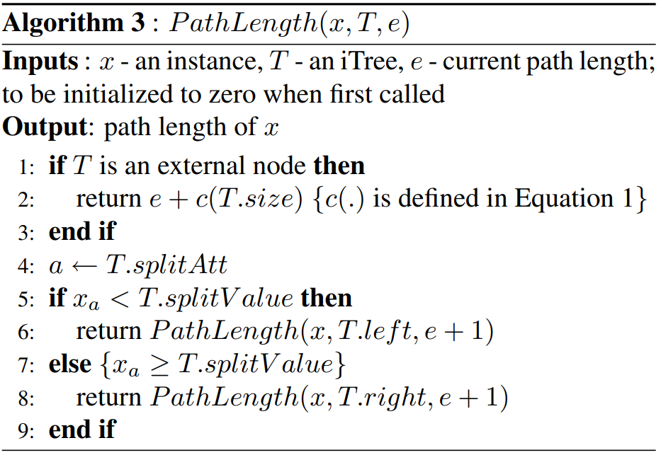

# Task03 集成模式
## 1. 为何集成
- 决策树的生成并不稳定，数据产生一定的噪音之后，整棵树构建出的样子可能会不一样。
- 可以通过训练多个决策树来提升稳定性：
    - 每棵树会独立的进行训练，训练之后这些树一起作用得出结果；
    - 分类的话，可以用投票（少数服从多数）；
    - 回归的话，可以对每棵树的结果求平均；
- 具体策略：
    - bagging：利用多个低偏差的学习器进行集成来降低模型的方差
    - boosting：或者利用多个低方差学习器进行集成来降低模型的偏差

## 2.bagging与boosting
- Bagging：在训练集中随机采样一些样本出来（放回，可重复）； 更进一步的随机森林算法，在bagging出来的数字中，再随机采样一些特征出来，不用整个特征。
- Boosting：
    - 顺序完成多个树的训练（串行集成，Bagging是独立的完成）
    - 利用训练好的树与真实值做残差来训练新的树，训练好了之后再与之前的树相加
    - 残差 等价于 取了一个平均均方误差（预测值与真实值的）再求梯度乘上个负号（因此叫做梯度提升树）


## 3.stacking与blending
- stacking本质上也属于并行集成方法，但其并不通过抽样来构造数据集进行基模型训练，而是采用K折交叉验证。
- blending在数据集上按照一定比例划分出训练集和验证集，每个基模型在训练集上进行训练。它的优势是模型的训练次数更少，但其缺陷在于不能使用全部的训练数据，相较于使用交叉验证的stacking稳健性较差。

## 4. 两种并行集成的树模型 
- **随机森林**：以决策树（常用CART树）为基学习器的bagging算法
    - 回归问题：输出值为各学习器的均值
    - 分类问题：
        - 1.投票策略，即每个学习器输出一个类别，返回最高预测频率的类别（来自原始论文） 
        - 2.sklearn中采用的概率聚合策略，即通过各个学习器输出的概率分布先计算样本属于某个类别的平均概率，在对平均的概率分布取argmax以输出最可能的类别
    随机森林中的随机性来源：
        - bootstrap抽样导致的训练集随机性
        - 每个节点随机选取特征子集进行不纯度计算的随机性
        - 当使用随机分割点选取时产生的随机性（此时的随机森林又被称为Extremely Randomized Trees）
- **孤立森林**：孤立森林也是一种使用树来进行集成的算法，其功能是用于连续特征数据的**异常检测**。
    - 孤立森林的基本思想是：多次随机选取特征和对应的分割点以分开空间中样本点，那么异常点很容易在较早的几次分割中就已经与其他样本隔开，正常点由于较为紧密故需要更多的分割次数才能将其分开。

## 5.侧边栏练习
$$
\begin{aligned}
L(\hat{f}) &= \mathbb{E}_D(y-\hat{f}_D)^2\\
&= \mathbb{E}_D(f+\epsilon-\hat{f}_D+\mathbb{E}_D[\hat{f}_{D}]-\mathbb{E}_D[\hat{f}_{D}])^2 \\
&= \mathbb{E}_D[(f-\mathbb{E}_D[\hat{f}_{D}])+(\mathbb{E}_D[\hat{f}_{D}]-\hat{f}_D)+\epsilon]^2 \\
&= \mathbb{E}_D[(f-\mathbb{E}_D[\hat{f}_{D}])^2] + \mathbb{E}_D[(\mathbb{E}_D[\hat{f}_{D}]-\hat{f}_D)^2] + \mathbb{E}_D[\epsilon^2] \\
&= [f-\mathbb{E}_D[\hat{f}_{D}]]^2 + \mathbb{E}_D[(\mathbb{E}_D[\hat{f}_{D}]-\hat{f}_D)^2] + \sigma^2
\end{aligned}
$$
1.上式第四个等号为何成立？

答：
$$
\begin{aligned}
& \mathbb{E}_{D}\left[\left(f-\mathbb{E}_{D}\left[\hat{f}_{D}\right]\right)+\left(\mathbb{E}_{D}\left[\hat{f}_{D}\right]-\hat{f}_{D}\right)+\epsilon\right]^{2} \\
&=\mathbb{E}_{D}\left[\left(f-\mathbb{E}_{D}\left[\hat{f}_{D}\right]\right)^{2}\right]+\mathbb{E}_{D}\left[\left(\mathbb{E}_{D}\left[\hat{f}_{D}\right]-\hat{f}_{D}\right)^{2}\right]+\mathbb{E}_{D}\left[\epsilon^{2}\right] \\
&+2 \mathbb{E}_{D}\left[\epsilon\left(f-\mathbb{E}_{D}\left[\hat{f}_{D}\right]\right)\right]+2 \mathbb{E}_{D}\left[\epsilon\left(\mathbb{E}_{D}\left[\hat{f}_{D}\right]-\hat{f}_{D}\right)\right] \\
&+2 \mathbb{E}_{D}\left[\left(f-\mathbb{E}_{D}\left[\hat{f}_{D}\right]\right)\left(\mathbb{E}_{D}\left[\hat{f}_{D}\right]-\hat{f}_{D}\right)\right]\\
\end{aligned}
$$ 

由于
$ \mathbb{E}_{D}[\epsilon]=0 $
且
$$ 
\begin{aligned}
& \mathbb{E}_{D}\left[\left(f-\mathbb{E}_{D}\left[\hat{f}_{D}\right]\right)\left(\mathbb{E}_{D}\left[\hat{f}_{D}\right]-\hat{f}_{D}\right)\right] \\
=& \mathbb{E}_{D}\left[f \mathbb{E}_{D}\left[\hat{f}_{D}\right]\right]-\mathbb{E}_{D}\left[\mathbb{E}_{D}\left[\hat{f}_{D}\right]^{2}\right]-\mathbb{E}_{D}\left[f \hat{f}_{D}\right]+\mathbb{E}_{D}\left[\mathbb{E}_{D}\left[\hat{f}_{D}\right] \hat{f}_{D}\right] \\
=& f \mathbb{E}_{D}\left[\hat{f}_{D}\right]-\mathbb{E}_{D}\left[\hat{f}_{D}\right]^{2}-f \mathbb{E}_{D}\left[\hat{f}_{D}\right]+\mathbb{E}_{D}\left[\hat{f}_{D}\right]^{2} \\
=& 0\\
\end{aligned}
$$ 
故上式
$$
\begin{aligned}
&=\mathbb{E}_{D}\left[\left(f-\mathbb{E}_{D}\left[\hat{f}_{D}\right]\right)^{2}\right]+\mathbb{E}_{D}\left[\left(\mathbb{E}_{D}\left[\hat{f}_{D}\right]-\hat{f}_{D}\right)^{2}\right]+\mathbb{E}_{D}\left[\epsilon^{2}\right] \\
\end{aligned}
$$
2.有人说[Bias-Variance Tradeoff](https://en.wikipedia.org/wiki/Bias%E2%80%93variance_tradeoff)就是指“一个模型要么具有大的偏差，要么具有大的方差”，你认为这种说法对吗？你能否对“偏差-方差权衡”现象做出更准确的表述？

答：不完全正确，如果模型可以拟合绝大多数数据，那么偏差和方差都会在一个比较小的范围。

但由于模型总是无法完美拟合所有数据，在某种程度上二者存在不可调和的矛盾。

具体来说，

**偏差**度量了学习算法的期望预测与真实结果的偏离程度，刻画了学习算法本身的拟合能力。

**方差**度量了同样大小的训练集的变动所导致的学习性能的变化，刻画了数据扰动所造成的影响。

**噪声**表达了当前任务上任何学习算法所能达到的期望泛化误差的下界，也就是最小值。

泛化误差可以分解为偏差、方差和噪声之和。在训练达到一定的程度后，需要在偏差和方差之间有所权衡，使得泛化误差最低，即模型即有较高的预测精度，也有较强的泛化能力。

3.假设总体有$100$个样本，每轮利用bootstrap抽样从总体中得到$10$个样本（即可能重复），请求出所有样本都被至少抽出过一次的期望轮数。（通过[本文](https://en.wikipedia.org/wiki/Coupon_collector%27s_problem)介绍的方法，我们还能得到轮数方差的bound）

答：假设T为所有n个样本都至少被抽出一次的轮数，$t_i$表示已经抽到了$i-1$个不重复样本后，抽到第i个不重复样本所用的轮数，则$T=t_1+t_2+\dots+t_n$。

对于$t_i$，抽到一个新样本的概率为：

$p_{i}=\frac{n-(i-1)}{n}=\frac{n-i+1}{n}$

故对于$E(T)$有
$$
\begin{aligned}
E(T) &=E\left(t_{1}+t_{2}+\cdots+t_{n}\right) \\
&=E\left(t_{1}\right)+E\left(t_{2}\right)+\cdots+E\left(t_{n}\right) \\
&=\frac{1}{p_{1}}+\frac{1}{p_{2}}+\cdots+\frac{1}{p_{n}} \\
&=\frac{n}{n}+\frac{n}{n-1}+\cdots+\frac{n}{1} \\
&=n \cdot\left(\frac{1}{1}+\frac{1}{2}+\cdots+\frac{1}{n}\right) \\
&=n \cdot H(n)
\end{aligned}
$$

总共有100个样本，则所有样本都被至少抽出过一次的期望抽取次数为$E(T)=100 \cdot H(100)≈460$，因此期望轮次为46次。

4.对于stacking和blending集成而言，若$m$个基模型使用$k$折交叉验证，此时分别需要进行几次训练和几次预测？

答：对于stacking 需要训练mk+1次，预测 2mk+1次。对于blending需要训练m+1次，预测2m+1次。

5.r2_score和均方误差的区别是什么？它具有什么优势？

答：定义**总体离差平方和**（(Sum of Squares for total，SST）为：
$  S_{t o t}=\sum_{i}\left(y_{i}-\bar{y}\right)^{2}$

定义**回归平方和**(Sum of Squares for regression，SSR)为：$S S_{r e g}=\sum_{i}\left(\hat{y}_{i}-\bar{y}\right)^{2}$

其中，$y$ 是实际的标签值， $\hat{y_i}$是模型预测的输出值,$\bar{y}$是样本标签平均值

SST刻画的误差，可分为两部分。一部分来自于我们拟合出来的模型，用它刻画数据的变异差值，即 $SS_{reg}$(即SSR）,另一部分是模型本身带来的误差，即：**残差平方和**（residual sum of squares，简称RSS）,定义为:$S S_{r e s}=\sum_{i=1}^{n}\left(y_{i}-\hat{y}_{i}\right)^{2}=\sum_{i} e_{i}^{2}$,

且有
$S S_{\text {tot }}=S S_{\text {reg }}+S S_{\text {res }}$

r2_score就是回归平方和与总平方和之比，根据上述定义则有：
$$
\begin{aligned}R^{2}&=\frac{S S_{\text {reg }}}{S S_{\text {tot }}} \\
     &=1-\frac{S S_{\text {res }}}{S S_{\text {total }}}\\
     &=1-\frac{\sum_{i}\left(y_{i}-y_{i}\right)^{2} / n}{\sum_{i}\left(y_{i}-\hat{y}\right)^{2} / n}\\
     &=1-\frac{R M S E}{V a r}
\end{aligned}
$$
其衡量了**预测误差**与**平均期望**之间的关系，取值在0到1之间，即数值大小反映了回归贡献的相对程度，即在因变量Y的总变异中，回归关系所能解释的百分比。(对于测试集合而言，若预测误差比平均期望还要大，其值还可能为负值)。

优点：使用RMSE来衡量模型对数据的拟合程度时，容易受到因变量（目标）和自变量（特征）量纲大小的影响，而r2_score衡量的是百分比，不受量纲的影响。

6.假设使用闵氏距离来度量两个嵌入向量之间的距离，此时对叶子节点的编号顺序会对距离的度量结果有影响吗？

答：没有影响，两个嵌入向量之间的距离度量的是向量的各个特征，与顺序没有关系。

## 6. 知识回顾

1. 什么是偏差和方差分解？偏差是谁的偏差？此处的方差又是指什么？

    答：泛化误差可以分解为偏差、方差和噪声之和。偏差度量了学习算法的期望预测与真实结果的偏离程度，刻画了学习算法本身的拟合能力。方差度量了同样大小的训练集的变动所导致的学习性能的变化，刻画了数据扰动所造成的影响。

2. 相较于使用单个模型，bagging和boosting方法有何优势？

    答：bagging可以降低整体模型的方差，boosting可以降低整体模型的偏差。

3.请叙述stacking的集成流程，并指出blending方法和它的区别

答：
- stacking的集成流程：对所有的基模型进行K折交叉验证训练，依次取遍K份验证数据就可以分别训练得到K个模型以及K份验证集上的相应预测结果，这些预测结果恰好能够拼接起来作为基模型在训练集上的学习特征，最后基于新的训练集进行训练。同理，预测的过程也要先经过所有基模型的预测形成新的测试集，最后再对测试集进行预测

- blending 的区别在于合成新的训练集的方式有所不同。         
    - blending在数据集上按照一定比例划分出训练集和验证集，每个基模型在训练集上进行训练（不做交叉验证），将训练好的所有基模型对验证集进行预测，第j个基模型对第i个验证集样本的预测值将作为新的训练集中第i个样本的第j个特征值。

    - 优势是模型的训练次数更少，但其缺陷在于不能使用全部的训练数据，相较于使用交叉验证的stacking稳健性较差。
    
4. 什么是随机森林的oob得分？
在随机森林bagging法中，对于总数为n的样本集合，进行n次有放回的随机抽样，得到大小为n的训练集，每次约有1/3的样本不会出现（没有被抽到）在bootstrap所采集的样本集合中，故没有参加决策树的建立，这些数据称为袋外数据oob，用于取代测试集误差估计方法，可用于模型的验证。

oob数据的各个样本的预测值之和除以各自的预测次数再求和取平均即为obb得分

5. 随机森林是如何集成多个决策树模型的？
- 回归问题：输出值为各学习器的均值
- 分类问题：
    - 1.投票策略，即每个学习器输出一个类别，返回最高预测频率的类别（来自原始论文） 
    - 2.sklearn中采用的概率聚合策略，即通过各个学习器输出的概率分布先计算样本属于某个类别的平均概率，在对平均的概率分布取argmax以输出最可能的类别

6. 请叙述孤立森林的算法原理和流程。

    - 算法原理：多次随机选取特征和对应的分割点以分开空间中样本点，那么异常点很容易在较早的几次分割中就已经与其他样本隔开，正常点由于较为紧密故需要更多的分割次数才能将其分开。
    - 流程：

    1.孤立树的创建：树的高度限制 $l$ 与子样本数量 $ψ $有关。之所以对树的高度做限制，是因为路径长度较短的点，更可能是异常点，而并不需要关注那些路径很长的正常点。
    
    2. 每个样本点的高度整合计算
    
    3.每个样本点的高度整合计算，其中 c(size) 是一个 adjustment 项，因为有一些样本点还没有被孤立出来，树就停止生长了，该项对其高度给出修正。
    

    总结：
    - 训练 iForest：从训练集中进行采样，构建孤立树，对森林中的每棵孤立树进行测试，记录路径长度；
    - 计算异常分数：根据异常分数计算公式，计算每个样本点的 anomaly score。


## 7. stacking
```python
from sklearn.model_selection import KFold
from sklearn.neighbors import KNeighborsRegressor
from sklearn.tree import DecisionTreeRegressor
from sklearn.linear_model import LinearRegression
from sklearn.datasets import make_regression
from sklearn.metrics import mean_squared_error
from sklearn.svm import SVR
from sklearn.preprocessing import StandardScaler
from sklearn.datasets import load_boston

from sklearn.model_selection import train_test_split

import numpy as np
import pandas as pd

m1 = KNeighborsRegressor()
m2 = SVR()
m3 = LinearRegression()
# m3 = DecisionTreeRegressor()


models = [m1, m2, m3]

final_model = DecisionTreeRegressor()

k, m = 5, len(models)


if __name__ == "__main__":
    boston = load_boston()
    X_data = boston['data']
    y_data = boston['target']
    # SS = StandardScaler()
    # X_data = SS.fit_transform(X_data)
    X, final_X, y, final_y = train_test_split(X_data, y_data, test_size=0.2, random_state=2)
    final_train = pd.DataFrame(np.zeros((X.shape[0], m)))
    final_test = pd.DataFrame(np.zeros((final_X.shape[0], m)))

    kf = KFold(n_splits=k)
    for model_id in range(m):
        for train_index, test_index in kf.split(X):
            model = models[model_id]
            X_train, X_test = X[train_index], X[test_index]
            y_train, y_test = y[train_index], y[test_index]
            model.fit(X_train, y_train)
            final_train.iloc[test_index, model_id] = model.predict(X_test)
            final_test.iloc[:, model_id] += model.predict(final_X)
        final_test.iloc[:, model_id] /= k
        print("模型{0}的均方误差{1}".format(model_id, mean_squared_error(final_test.iloc[:, model_id], final_y)))
    final_model.fit(final_train, y)
    res = final_model.predict(final_test)
    print("模型融合后的均方误差", mean_squared_error(res, final_y))
```

## 8. blending
```python

from sklearn.model_selection import KFold
from sklearn.model_selection import train_test_split
from sklearn.neighbors import KNeighborsRegressor
from sklearn.tree import DecisionTreeRegressor
from sklearn.linear_model import LinearRegression
from sklearn.datasets import make_regression
from sklearn.datasets import load_boston
from sklearn.metrics import mean_squared_error

import numpy as np
import pandas as pd

m1 = KNeighborsRegressor()
m2 = DecisionTreeRegressor()
m3 = LinearRegression()

models = [m1, m2, m3]

final_model = DecisionTreeRegressor()

m = len(models)

if __name__ == "__main__":
    boston = load_boston()
    X_data = boston['data']
    y_data = boston['target']

    X, X_test, y, y_test = train_test_split(X_data, y_data, test_size=0.25)
    X_train, final_X, y_train, final_y= train_test_split(X, y, test_size=0.5)

    final_train = pd.DataFrame(np.zeros((X_test.shape[0], m)))
    final_test = pd.DataFrame(np.zeros((final_X.shape[0], m)))

    for model_id in range(m):
        model = models[model_id]
        model.fit(X_train, y_train)
        final_train.iloc[:, model_id] = model.predict(X_test)
        final_test.iloc[:, model_id] += model.predict(final_X)
        print("模型{0}的均方误差{1}".format(model_id,
                                     mean_squared_error(model.predict(final_X), final_y)))

    final_model.fit(final_train, y_test)
    res = final_model.predict(final_test)
    print("模型融合后的均方误差", mean_squared_error(res, final_y))
```
不知为何，除了LinearRegression外，其他方法对于make_regression生成的数据，预测误差特别大。

## 9. 孤立森林算法
```python
from pyod.utils.data import generate_data
import matplotlib.pyplot as plt
import numpy as np


class Node:

    def __init__(self, depth):
        self.depth = depth
        self.left = None
        self.right = None
        self.feature = None
        self.pivot = None


class Tree:

    def __init__(self, max_height):
        self.root = Node(0)
        self.max_height = max_height
        self.c = None

    def _build(self, node, X,):
        if X.shape[0] == 1:
            return
        if node.depth+1 > self.max_height:
            node.depth += self._c(X.shape[0])
            return
        node.feature = np.random.randint(X.shape[1])
        pivot_min = X[:, node.feature].min()
        pivot_max = X[:, node.feature].max()
        node.pivot = np.random.uniform(pivot_min, pivot_max)
        node.left, node.right = Node(node.depth+1), Node(node.depth+1)
        self._build(node.left, X[X[:, node.feature]<node.pivot])
        self._build(node.right, X[X[:, node.feature]>=node.pivot])

    def build(self, X):
        self.c = self._c(X.shape[0])
        self._build(self.root, X)

    def _c(self, n):
        if n == 1:
            return 0
        else:
            return 2 * ((np.log(n-1) + 0.5772) - (n-1)/n)

    def _get_h_score(self, node, x):
        if node.left is None and node.right is None:
            return node.depth
        if x[node.feature] < node.pivot:
            return self._get_h_score(node.left, x)
        else:
            return self._get_h_score(node.right, x)

    def get_h_score(self, x):
        return self._get_h_score(self.root, x)


class IsolationForest:

    def __init__(self, n_estimators=100, max_samples=256):
        self.n_estimator = n_estimators
        self.max_samples = max_samples
        self.trees = []

    def fit(self, X):
        for tree_id in range(self.n_estimator):
            random_X = X[np.random.randint(0, X.shape[0], self.max_samples)]
            tree = Tree(np.log(random_X.shape[0]))
            tree.build(X)
            self.trees.append(tree)

    def predict(self, X):
        result = []
        for x in X:
            h = 0
            for tree in self.trees:
                h += tree.get_h_score(x) / tree.c
            score = np.power(2, - h/len(self.trees))
            result.append(score)
        return np.array(result)


if __name__ == "__main__":

    np.random.seed(0)

    # 1%异常点
    X_train, X_test, y_train, y_test = generate_data(
        n_train=1000, n_test=500, 
        contamination=0.05, behaviour="new", random_state=0
    )

    IF = IsolationForest()
    IF.fit(X_train)
    res = IF.predict(X_test)

    abnormal_X = X_test[res > np.quantile(res, 0.95)]

    plt.scatter(X_test[:, 0], X_test[:, 1], s=5)
    plt.scatter(
        abnormal_X[:, 0], abnormal_X[:, 1],
        s=30, edgecolors="Red", facecolor="none"
    )
    plt.show()
```

## 10.用于分类的随机森林算法
```python
import numpy as np
from sklearn.tree import DecisionTreeClassifier as Tree


class RandomForest:
    def __init__(self, n_estimators, max_depth):
        self.n_estimators = n_estimators
        self.max_depth = max_depth
        self.trees = []

    def fit(self, X, y):
        for tree_id in range(self.n_estimators):
            indexes = np.random.randint(0, X.shape[0], X.shape[0])
            random_X = X[indexes]
            random_y = y[indexes]
            tree = Tree(max_depth=3)
            tree.fit(random_X, random_y)
            self.trees.append(tree)

    def predict(self, X):
        results = []

        for x in X:
            result = []
            for tree in self.trees:
                result.append(tree.predict(x.reshape(1, -1))[0])

            results.append(np.argmax(np.bincount(result)))  # 返回该样本的预测结果，采取方案：多数投票
        return np.array(results)
```
测试效果
```python
from sklearn.datasets import make_classification
from sklearn.ensemble import RandomForestClassifier as RF
from RandomForest_Classifier import RandomForest
import numpy as np

if __name__ == "__main__":
    X, y = make_classification(n_samples=200, n_features=8, n_informative=4, random_state=0)

    RF1 = RandomForest(n_estimators=100, max_depth=3)
    RF2 = RF(n_estimators=100, max_depth=3)

    RF1.fit(X, y)
    res1 = RF1.predict(X)

    RF2.fit(X, y)
    res2 = RF2.predict(X)

    print('结果一样的比例', (np.abs(res1 - res2) < 1e-5).mean())
```