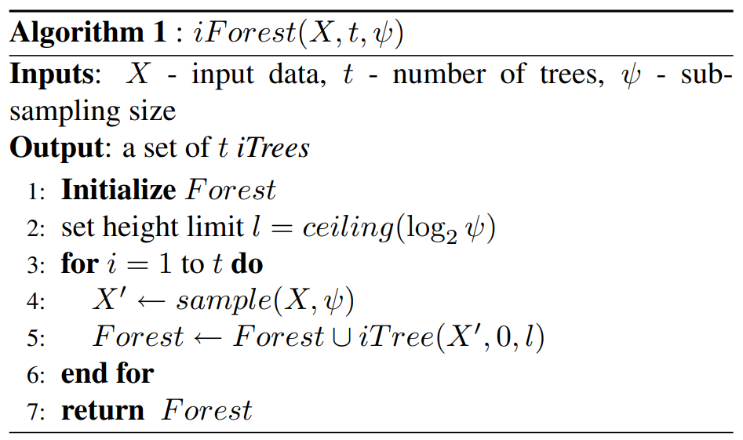
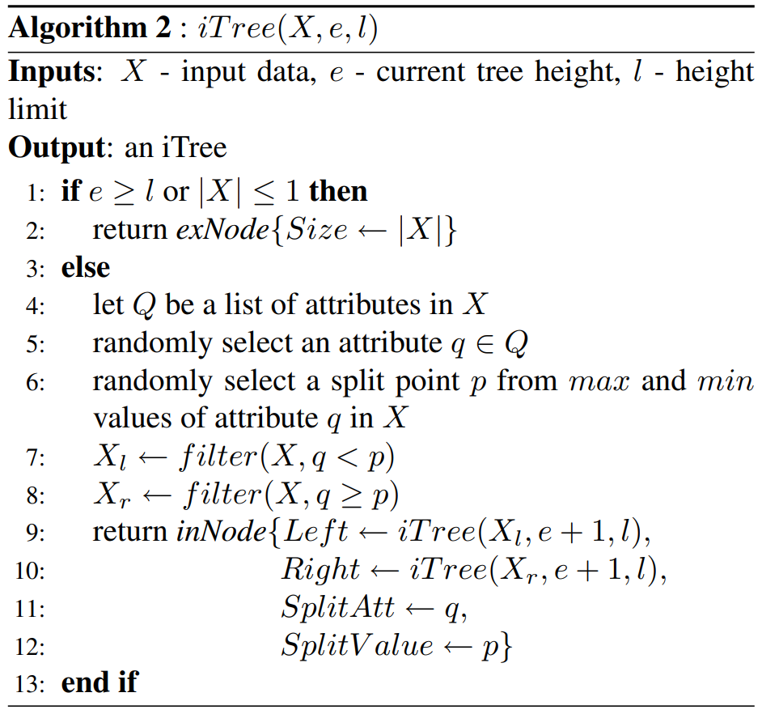
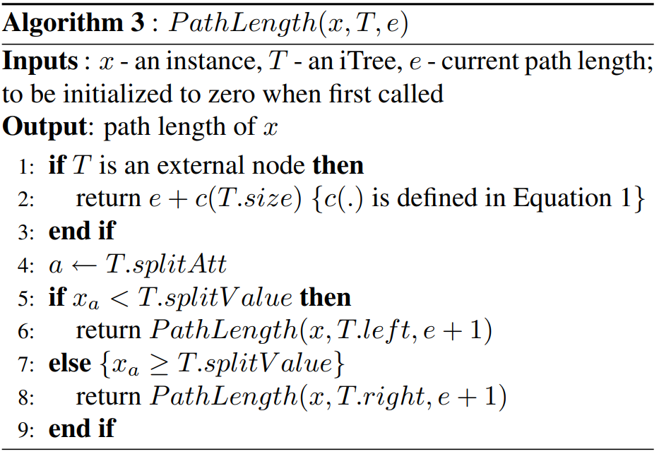

# Task04 并行集成的树模型

## 1. 两种并行集成的树模型 
- **随机森林**：以决策树（常用CART树）为基学习器的bagging算法
    - 回归问题：输出值为各学习器的均值
    - 分类问题：
        - 1.投票策略，即每个学习器输出一个类别，返回最高预测频率的类别（来自原始论文） 
        - 2.sklearn中采用的概率聚合策略，即通过各个学习器输出的概率分布先计算样本属于某个类别的平均概率，在对平均的概率分布取argmax以输出最可能的类别
    随机森林中的随机性来源：
        - bootstrap抽样导致的训练集随机性
        - 每个节点随机选取特征子集进行不纯度计算的随机性
        - 当使用随机分割点选取时产生的随机性（此时的随机森林又被称为Extremely Randomized Trees）
- **孤立森林**：孤立森林也是一种使用树来进行集成的算法，其功能是用于连续特征数据的**异常检测**。
    - 孤立森林的基本思想是：多次随机选取特征和对应的分割点以分开空间中样本点，那么异常点很容易在较早的几次分割中就已经与其他样本隔开，正常点由于较为紧密故需要更多的分割次数才能将其分开。

## 2.侧边栏练习

5.r2_score和均方误差的区别是什么？它具有什么优势？

答：定义**总体离差平方和**（(Sum of Squares for total，SST）为：
$  S_{t o t}=\sum_{i}\left(y_{i}-\bar{y}\right)^{2}$

定义**回归平方和**(Sum of Squares for regression，SSR)为：$S S_{r e g}=\sum_{i}\left(\hat{y}_{i}-\bar{y}\right)^{2}$

其中，$y$ 是实际的标签值， $\hat{y_i}$是模型预测的输出值,$\bar{y}$是样本标签平均值

SST刻画的误差，可分为两部分。一部分来自于我们拟合出来的模型，用它刻画数据的变异差值，即 $SS_{reg}$(即SSR）,另一部分是模型本身带来的误差，即：**残差平方和**（residual sum of squares，简称RSS）,定义为:$S S_{r e s}=\sum_{i=1}^{n}\left(y_{i}-\hat{y}_{i}\right)^{2}=\sum_{i} e_{i}^{2}$,

且有
$S S_{\text {tot }}=S S_{\text {reg }}+S S_{\text {res }}$

r2_score就是回归平方和与总平方和之比，根据上述定义则有：
$$
\begin{aligned}R^{2}&=\frac{S S_{\text {reg }}}{S S_{\text {tot }}} \\
     &=1-\frac{S S_{\text {res }}}{S S_{\text {total }}}\\
     &=1-\frac{\sum_{i}\left(y_{i}-y_{i}\right)^{2} / n}{\sum_{i}\left(y_{i}-\hat{y}\right)^{2} / n}\\
     &=1-\frac{R M S E}{V a r}
\end{aligned}
$$
其衡量了**预测误差**与**平均期望**之间的关系，取值在0到1之间，即数值大小反映了回归贡献的相对程度，即在因变量Y的总变异中，回归关系所能解释的百分比。(对于测试集合而言，若预测误差比平均期望还要大，其值还可能为负值)。

优点：使用RMSE来衡量模型对数据的拟合程度时，容易受到因变量（目标）和自变量（特征）量纲大小的影响，而r2_score衡量的是百分比，不受量纲的影响。

6.假设使用闵氏距离来度量两个嵌入向量之间的距离，此时对叶子节点的编号顺序会对距离的度量结果有影响吗？

答：没有影响，两个嵌入向量之间的距离度量的是向量的各个特征，与顺序没有关系。

## 3.知识回顾
4. 什么是随机森林的oob得分？
在随机森林bagging法中，对于总数为n的样本集合，进行n次有放回的随机抽样，得到大小为n的训练集，每次约有1/3的样本不会出现（没有被抽到）在bootstrap所采集的样本集合中，故没有参加决策树的建立，这些数据称为袋外数据oob，用于取代测试集误差估计方法，可用于模型的验证。

oob数据的各个样本的预测值之和除以各自的预测次数再求和取平均即为obb得分

5. 随机森林是如何集成多个决策树模型的？
- 回归问题：输出值为各学习器的均值
- 分类问题：
    - 1.投票策略，即每个学习器输出一个类别，返回最高预测频率的类别（来自原始论文） 
    - 2.sklearn中采用的概率聚合策略，即通过各个学习器输出的概率分布先计算样本属于某个类别的平均概率，在对平均的概率分布取argmax以输出最可能的类别

6. 请叙述孤立森林的算法原理和流程。

    - 算法原理：多次随机选取特征和对应的分割点以分开空间中样本点，那么异常点很容易在较早的几次分割中就已经与其他样本隔开，正常点由于较为紧密故需要更多的分割次数才能将其分开。
    - 流程：

    1.孤立树的创建：树的高度限制 $l$ 与子样本数量 $ψ $有关。之所以对树的高度做限制，是因为路径长度较短的点，更可能是异常点，而并不需要关注那些路径很长的正常点。
    
    2. 每个样本点的高度整合计算
    
    3.每个样本点的高度整合计算，其中 c(size) 是一个 adjustment 项，因为有一些样本点还没有被孤立出来，树就停止生长了，该项对其高度给出修正。
    

    总结：
    - 训练 iForest：从训练集中进行采样，构建孤立树，对森林中的每棵孤立树进行测试，记录路径长度；
    - 计算异常分数：根据异常分数计算公式，计算每个样本点的 anomaly score。

## 4. 孤立森林算法
```python
from pyod.utils.data import generate_data
import matplotlib.pyplot as plt
import numpy as np


class Node:

    def __init__(self, depth):
        self.depth = depth
        self.left = None
        self.right = None
        self.feature = None
        self.pivot = None


class Tree:

    def __init__(self, max_height):
        self.root = Node(0)
        self.max_height = max_height
        self.c = None

    def _build(self, node, X,):
        if X.shape[0] == 1:
            return
        if node.depth+1 > self.max_height:
            node.depth += self._c(X.shape[0])
            return
        node.feature = np.random.randint(X.shape[1])
        pivot_min = X[:, node.feature].min()
        pivot_max = X[:, node.feature].max()
        node.pivot = np.random.uniform(pivot_min, pivot_max)
        node.left, node.right = Node(node.depth+1), Node(node.depth+1)
        self._build(node.left, X[X[:, node.feature]<node.pivot])
        self._build(node.right, X[X[:, node.feature]>=node.pivot])

    def build(self, X):
        self.c = self._c(X.shape[0])
        self._build(self.root, X)

    def _c(self, n):
        if n == 1:
            return 0
        else:
            return 2 * ((np.log(n-1) + 0.5772) - (n-1)/n)

    def _get_h_score(self, node, x):
        if node.left is None and node.right is None:
            return node.depth
        if x[node.feature] < node.pivot:
            return self._get_h_score(node.left, x)
        else:
            return self._get_h_score(node.right, x)

    def get_h_score(self, x):
        return self._get_h_score(self.root, x)


class IsolationForest:

    def __init__(self, n_estimators=100, max_samples=256):
        self.n_estimator = n_estimators
        self.max_samples = max_samples
        self.trees = []

    def fit(self, X):
        for tree_id in range(self.n_estimator):
            random_X = X[np.random.randint(0, X.shape[0], self.max_samples)]
            tree = Tree(np.log(random_X.shape[0]))
            tree.build(X)
            self.trees.append(tree)

    def predict(self, X):
        result = []
        for x in X:
            h = 0
            for tree in self.trees:
                h += tree.get_h_score(x) / tree.c
            score = np.power(2, - h/len(self.trees))
            result.append(score)
        return np.array(result)


if __name__ == "__main__":

    np.random.seed(0)

    # 1%异常点
    X_train, X_test, y_train, y_test = generate_data(
        n_train=1000, n_test=500, 
        contamination=0.05, behaviour="new", random_state=0
    )

    IF = IsolationForest()
    IF.fit(X_train)
    res = IF.predict(X_test)

    abnormal_X = X_test[res > np.quantile(res, 0.95)]

    plt.scatter(X_test[:, 0], X_test[:, 1], s=5)
    plt.scatter(
        abnormal_X[:, 0], abnormal_X[:, 1],
        s=30, edgecolors="Red", facecolor="none"
    )
    plt.show()
```

## 5.用于分类的随机森林算法
```python
import numpy as np
from sklearn.tree import DecisionTreeClassifier as Tree


class RandomForest:
    def __init__(self, n_estimators, max_depth):
        self.n_estimators = n_estimators
        self.max_depth = max_depth
        self.trees = []

    def fit(self, X, y):
        for tree_id in range(self.n_estimators):
            indexes = np.random.randint(0, X.shape[0], X.shape[0])
            random_X = X[indexes]
            random_y = y[indexes]
            tree = Tree(max_depth=3)
            tree.fit(random_X, random_y)
            self.trees.append(tree)

    def predict(self, X):
        results = []

        for x in X:
            result = []
            for tree in self.trees:
                result.append(tree.predict(x.reshape(1, -1))[0])

            results.append(np.argmax(np.bincount(result)))  # 返回该样本的预测结果，采取方案：多数投票
        return np.array(results)
```
测试效果
```python
from sklearn.datasets import make_classification
from sklearn.ensemble import RandomForestClassifier as RF
from RandomForest_Classifier import RandomForest
import numpy as np

if __name__ == "__main__":
    X, y = make_classification(n_samples=200, n_features=8, n_informative=4, random_state=0)

    RF1 = RandomForest(n_estimators=100, max_depth=3)
    RF2 = RF(n_estimators=100, max_depth=3)

    RF1.fit(X, y)
    res1 = RF1.predict(X)

    RF2.fit(X, y)
    res2 = RF2.predict(X)

    print('结果一样的比例', (np.abs(res1 - res2) < 1e-5).mean())
```